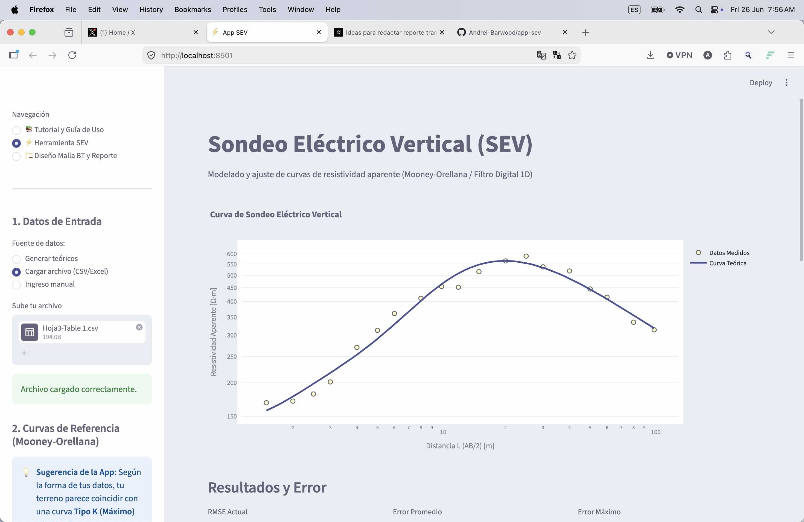
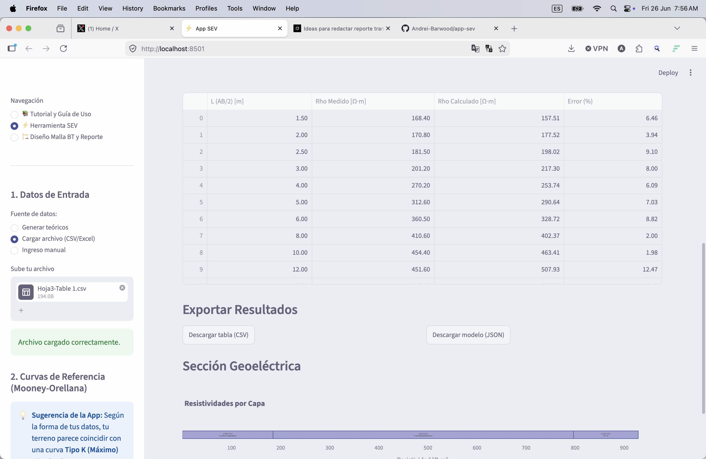

# App SEV - Sondeo Eléctrico Vertical ⚡


Herramienta profesional para el modelado y ajuste automático de curvas de Sondeo Eléctrico Vertical (SEV) utilizando el formalismo de Mooney-Orellana y la transformada de Hankel con el filtro digital de Ghosh. 

**Desarrollo:** Kirtan Teg Singh (ਕੀਰਤਨ ਤੇਗ ਸਿੰਘ)  
**Propietario:** snocomm  
⚠️ **PROHIBIDA SU VENTA**

## Características

- 📊 **Cálculos Precisos:** Resolución del problema directo de resistividad para arreglos Schlumberger de hasta 10 capas.
- 🎯 **Ajuste Automático:** Combinación de Evolución Diferencial (optimización global) y Mínimos Cuadrados (refinamiento local) para encontrar los mejores espesores y resistividades a partir de datos de campo.
- 💾 **Curvas de Referencia:** Diccionario precargado con curvas maestras de Mooney-Orellana (Tipo H, K, A, Q y de 2 capas).
- 📈 **Visualización Interactiva:** Gráficos Log-Log y sección geoeléctrica transversal utilizando Plotly.

## App en acción





## Descarga (binarios standalone)

En la sección [Releases](https://github.com/Andrei-Barwood/app-sev/releases) encontrarás ejecutables listos para usar, sin instalar Python ni dependencias:

| Plataforma | Archivo |
|------------|---------|
| **Windows** | `app-sev-windows.zip` |
| **macOS** | `app-sev-macos.zip` |
| **Linux** | `app-sev-linux.tar.gz` |

1. Descarga el archivo correspondiente a tu sistema operativo.
2. Descomprime el archivo.
3. Ejecuta `AppSEV` (macOS/Linux) o `AppSEV.exe` (Windows).
4. La aplicación se abrirá en una ventana de escritorio nativa.

> **Windows:** requiere [.NET Framework 4+](https://dotnet.microsoft.com/download/dotnet) y [Edge WebView2](https://developer.microsoft.com/microsoft-edge/webview2).

## Instalación Local

1. Clona este repositorio:
   ```bash
   git clone https://github.com/Andrei-Barwood/app-sev.git
   cd app-sev
   ```
2. Crea un entorno virtual e instala las dependencias:
   ```bash
   python -m venv .venv
   source .venv/bin/activate  # En Windows usa: .venv\\Scripts\\activate
   pip install -r requirements.txt
   ```
3. Ejecuta la aplicación:
   ```bash
   streamlit run app.py
   ```

## Alojamiento en Streamlit Cloud (Recomendado)
Esta aplicación está diseñada para ser hosteada de manera gratuita en **Streamlit Community Cloud**. 
1. Conecta este repositorio en tu cuenta de GitHub a [share.streamlit.io](https://share.streamlit.io).
2. Obtén la URL de tu aplicación (ej. `https://tu-app-sev.streamlit.app`).
3. (Opcional) Usa la extensión de navegador provista en los "Releases" para acceder a la app desde la barra de tareas de tu navegador con un solo clic.

## Extensión Web
En los *Releases* de este repositorio o en la carpeta `browser_extension/` encontrarás una extensión para Google Chrome/Edge que te permitirá lanzar la aplicación rápidamente. Simplemente carga la carpeta como "Extensión Descomprimida" o instala el `.zip` en tu navegador y configura la URL de tu app.
